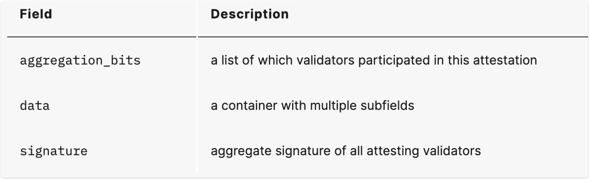

# Summary

Gasper는 Casper FFG와 LMD GHOST를 합친 것을 의미하며 블록체인 네트워크 상의 신뢰할 수 없거나 검증자가 악의적인 경우에도 합의가 가능하도록 하는 것이 Gasper의 목표입니다.

이더리움 공식 github 문서를 통해 Gasper의 합의 과정을 분석한 글입니다.
### Description

이더리움의 블록 구조의 **body**에 대한 **Field**는 다음과 같습니다. 

여러 Field 중 **attestations**에 Gasper가 관여하게 됩니다.
 
**attestations** Field는 다음과 같습니다.

- aggregation_bits : validator의 참여 유/무를 나타냅니다 (참여: 1, 불참 : 0)
- data : attestation에 대한 여러 Field가 존재합니다.
- signature : 검증에 참여한 validator들의 signature을 BLS signature 알고리즘을 통해서 합친 것을 의미합니다. 

**data** Field는 다음과 같습니다.

- slot : attestation에 연관된 slot을 의미합니다
- index : 검증에 참여한 comittee의 index를 의미합니다
- beacon_block_root : LMD_GHOST vote 결과의 head block의 root 값을 의미합니다.
- source : Casper FFG에 의해 가장 최근의 justfied된 checkpoint를 의미합니다
- target : 가장 최근의 epoch을 의미합니다.

#### LMD GHOST

LMD GHOST vote 결과로 선정된 head block에 대한 root 값을  beacon_block_root로 저장합니다.

head block은 다음과 같은 과정을 통해서 선정됩니다.

1. 유효한 분기만 포함하는 block tree를 가져옵니다.
2. **가장 최근의 justified된 checkpoint의 root**에서 시작해서 모든 자식 블록을 찾습니다.
3. 자식 블록들 중에서 부모 블록의 root 값이 가장 최근의 **justified된 checkpoint의 root** 와 같은지 비교합니다.
4. 모든 자식 블록들 중에서 **가장 큰 가중치**를 가진 블록을 새로운 head block으로 선정합니다.

가중치를 매기는 과정은 다음과 같습니다.

1. 검증에 참여하는 validator의 조건을 확인합니다. (슬래싱 여부, attest message 대상 block의 root 값이 같은지 등)
2. 조건을 만족하는 validator들의 attest message에 대한 점수를 매깁니다.
3. 가중치에 대한 점수는 validator들의 **effective balance(최대 32ETH)** 의 합으로 결정됩니다.

그림으로 표현하면 다음과 같습니다.

1. validator들의 attest message가 가리키는 block 중에서 가장 큰 가중치를 가진 블록을 head로 설정
2. 가중치를 매기는 것은 validator의 effective_balance의 합을 통해서 결정하게 된다.
#### Casper FFG

- source : 가장 최근의 justified된 checkpoint로 설정합니다.
- target : 일반적으로 가장 최근의 epoch이 target이 됩니다.
	- 현재 slot이 epoch의 첫 slot과 같으면 현재 head block의 해시 값을 root로 사용합니다.
	- 반대상황이면 epoch의 첫 번째 slot에 해당하는 block의 root 값을 가져옵니다.

다음 과정을 통해서 블록의 불변성을 보장합니다.

1. validate_on_attestation : target으로 선정한 epoch에 대한 검사
2. store_target_checkpoint_state : store에 checkpoint에 대한 관리
3. update_latest_messages : Casper FFG와 LMD GHOST결과 업데이트

> store : Fork choice 알고리즘을 위해 필요한 정보를 저장하고 관리하는 object

-  현재 attestation이 진행중인 epoch를 target으로 지정 
-  target epoch와 attestation의 slot의 대한 epoch이 같은지 확인
-  target으로 하려는 epoch의 첫 slot이 beacon 체인 내 존재하는지 확인
-  LMD GHOST의 결과로 선정된 block이 beacon 체인 내 존재하는지 확인
-  attestation의 slot 번호가 beacon 체인의 root에 해당하는 slot 보다 크거나 같은지 확인
-  최근의 slot이 attestation 중인 slot보다 1 크거나 같은지 확인

**attestation data**에 대한 정보를 검증을 거친 후 **checkpoint** 관리로 넘어갑니다.

- store에 checkpoint가 저장되어있는지 확인
- 저장 유/무에 따라 state를 복사하거나 다음 과정으로 넘어갑니다.
- base state에 대한 slot이 target epoch의 첫 slot보다 작은지 확인
- base state의 slot이 작으면 **process_slots** 함수를 호출합니다

**process_slots**에서 과정은 다음과 같습니다.

- **process_slots**에서 target slot보다 작을 때 까지 slot을 1씩 더합니다.
- 다음 slot이 epoch에 해당하는 첫 slot인 경우에 **process_epoch** 함수를 호출합니다.

**process_epoch** 에서의 여러 함수들 중 **process_justification_and_finalization** 함수만 살펴보도록 하겠습니다.

- 이전과 현재 epoch에서 검증에 참여한 validator들의 index를 가져옵니다.
- active 상태의 validator들의 모든 effective balance의 합(**active_balance**)을 구합니다.
- 이전과 현재 epoch에서의 검증에 참여한 validator들의 active_balance의 값을 구합니다.
- 구한 값을 이용해서 **weigh_justification_and_finalization** 함수를 호출합니다.

**weigh_justification_and_finalization** 과정은 다음과 같습니다.

**justified checkpoint** 부터 수정한 후 **finalization checkpoint**를 수정합니다
- justified 했던 epoch들 중에서 마지막 epoch을 제거하고 새로운 epoch에 대한 값(**0**)을 할당합니다.
- justified 되기위한 조건을 통과하면 할당했던 값(**0**)을 수정(**1**)합니다.

> 어떤 epoch을 target으로 지정한 validator들의 총 effective balance의 값이 active 상태의 validator의 총 effective balance 값의 2/3과 같거나 크면  해당 epoch은 **justified checkpoint**가 됩니다.

**justified checkpoint**에서 **finalized checkpoint**가 되기 위한 조건은 다음과 같습니다.

**1. [E] - [J] - [J] - [J]  인 경우**
- 결과 : [**F**]  J  J  J

 
**2. [E] - [E] - [J] - [J]  인 경우**
- 결과 : [**F**]  E  J  J

      
**3. [E] - [J] - [J] - [J]  인 경우**
- 결과 : E  [**F**]  J  J

**4. [E] - [E] - [J] - [J] 인 경우**
- 결과 : E  E  [**F**]  J

> **E: Any epoch** **J: Justified epoch** **F: Finalized epoch**

**justfied checkpoint**가 새로 생기면 **이전의 justfied checkpoint**는 **finalized checkpoint**로 설정되며 justified와 finalized 간의 link를 **supermajority link**라고합니다.

결론적으로 Casper FFG 과정을 짧게 정리하면 다음과 같습니다.

1.  validator attestation data는 현재 head의 state와 target checkpoint를 참조하여 생성

2.  validator의 attestation에 대한 유효성을 검사

3.  Casper FFG는 checkpoint 주기 (1 epoch) 마다 justified와 finalized를 판단한다.

>  justified가 되기 위해서는 전체 active validator의 2/3 이상의 target epoch에 대한 attestation이 모여야 한다.
### References

- https://eth2book.info/capella/part2/consensus/casper_ffg/
- https://beaconcha.in/
- [https://github.com/ethereum/consensus-specs/blob/dev/specs/phase0/fork-choice.md](https://github.com/ethereum/consensus-specs/blob/dev/specs/phase0/fork-choice.md "https://github.com/ethereum/consensus-specs/blob/dev/specs/phase0/fork-choice.md")
- [https://github.com/ethereum/consensus-specs/blob/dev/specs/phase0/beacon-chain.md](https://github.com/ethereum/consensus-specs/blob/dev/specs/phase0/beacon-chain.md "https://github.com/ethereum/consensus-specs/blob/dev/specs/phase0/beacon-chain.md")
- https://nullorm.tistory.com/56
### Related Keywords

- [[Consensus]]
- [[Casper FFG]]
- [[LMD GHOST]]

### ETC

자료 검토해주신 `@vero` 멘토님께 감사드립니다.
